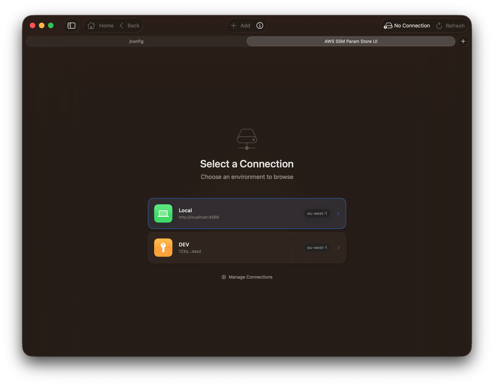
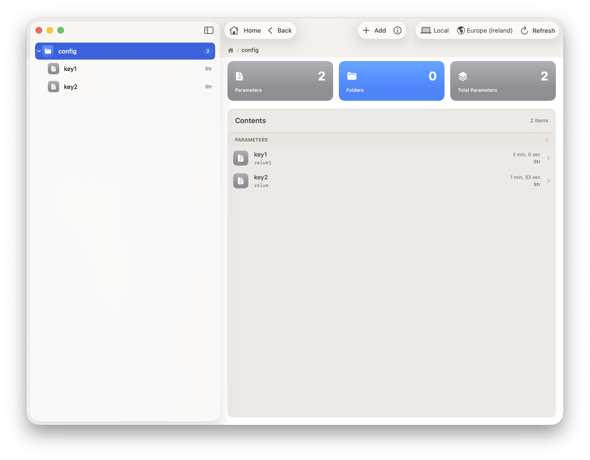
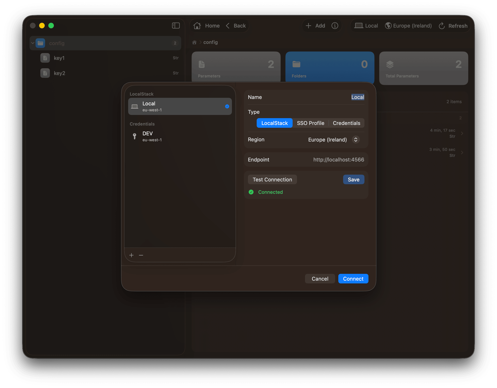
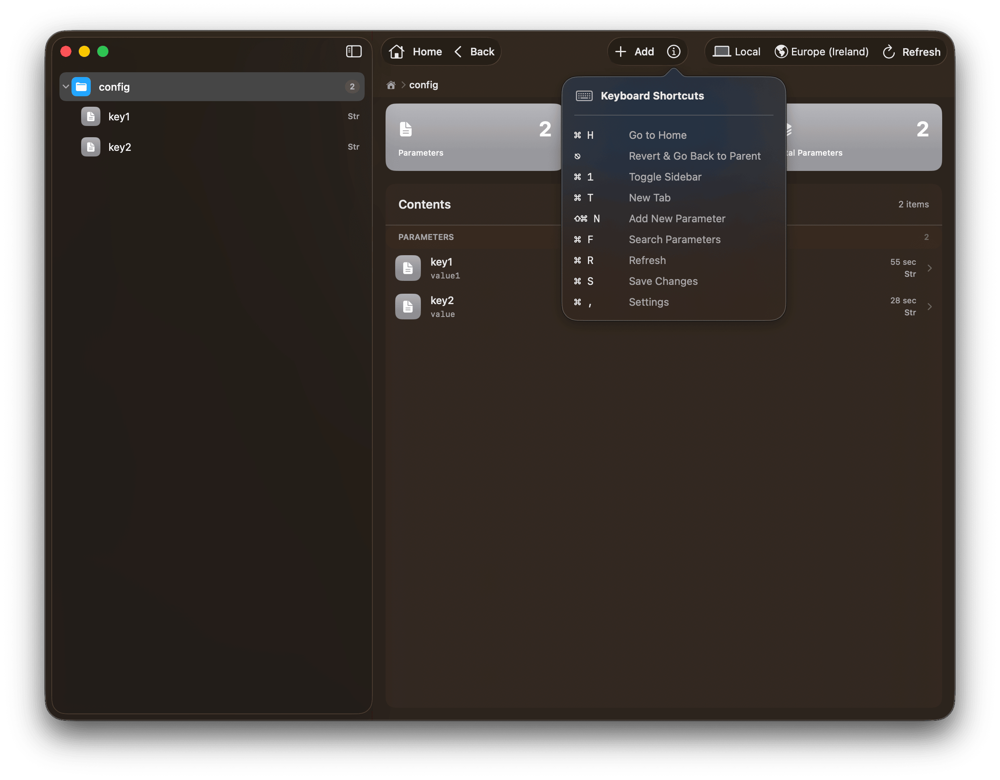
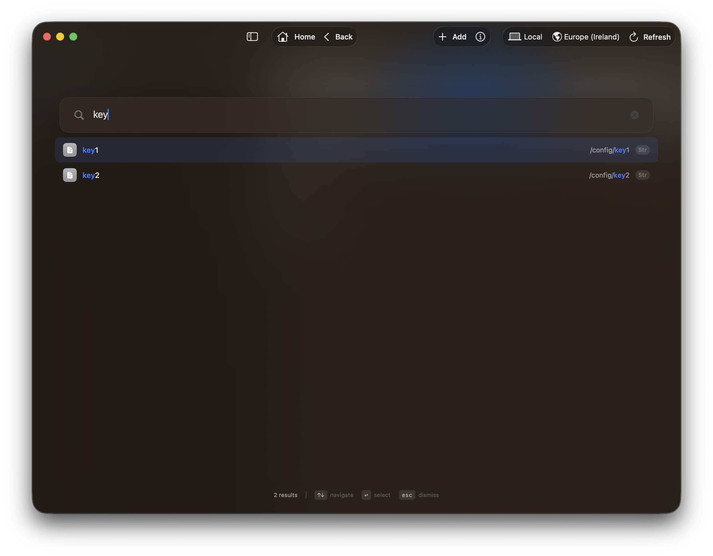
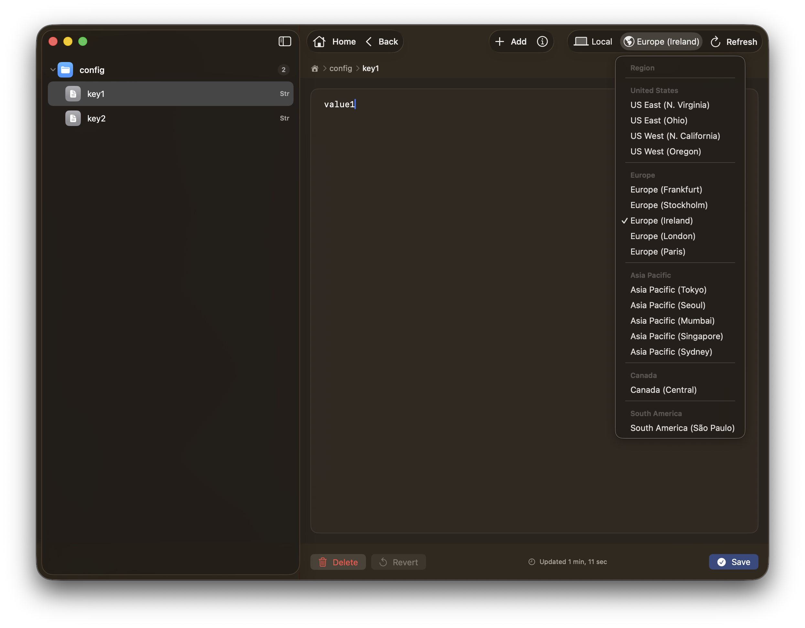
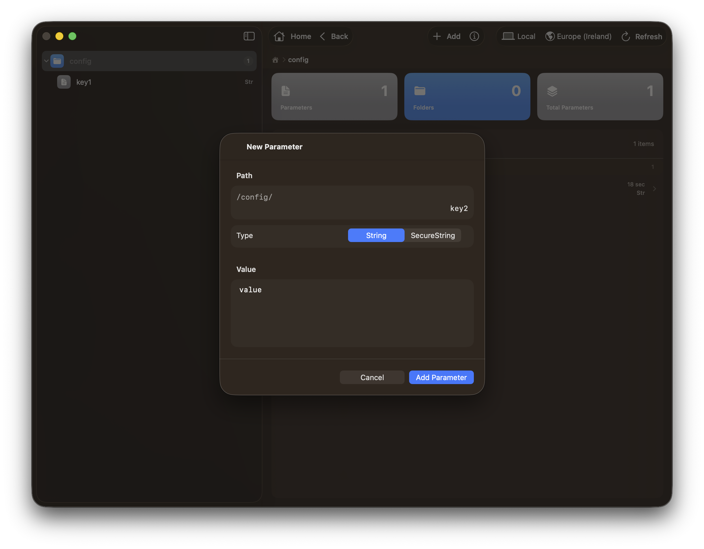
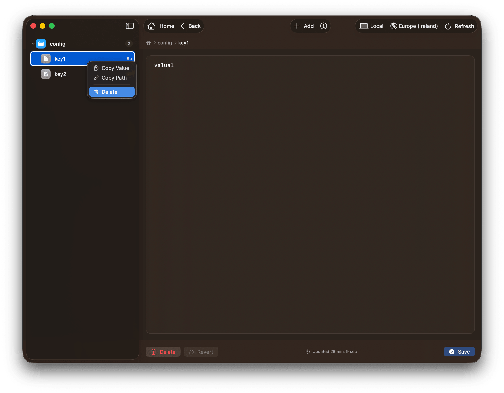

# AWS SSM Param Store UI

A native macOS app for browsing and editing [AWS Systems Manager Parameter Store](https://docs.aws.amazon.com/systems-manager/latest/userguide/systems-manager-parameter-store.html).

## Requirements

- macOS 26 (Tahoe) or later

## Install

```bash
brew install --cask bilal-fazlani/tap/aws-ssm-param-store-ui
```

## Features

### Multi tab support
Select connections with keyboard navigation and open new tabs with `⌘ + T`.

New windows can be opened with `⌘` + `N`

Drag and drop of tabs supported.



### Dark and light mode support
The app supports dark and light mode depending on the system appearance.



### Manage connections
The app supports managing connections to AWS Parameter Store.

Support for SSO Profile, Credentials and LocalStack.



### Built for keyboard users
The app supports keyboard shortcuts for common actions.



### Find parameter
The app supports finding parameters by name or path.

The find interface is very fast and allows searching in the path and values of the parameters.



### Multi region support
The app supports easy switching between regions while maintaining current navigation context where possible.



### Add parameter
Easy to add new parameters with `⌘` + `⇧` + `N`

Secure string values are supported.



### Delete / parameter
Context menu to 

- delete parameters 
- delete folders
- copy paths
- copy values


